# OSLO Slimme Raadpleegomgeving

De opzet van dit traject is om inhoudelijke annotaties toe te voegen aan de besluiten. Er wordt hierbij gekeken naar het toevoegen van geo-informatie (straten, wijken, …), thema-informatie en het linken van reglementen zodat een gecoördineerde versie steeds centraal beschikbaar is.

# Voorbeelden

## Locatie-gebaseerde informatie

Het AP gebruikt de eigenschap [geografischeDekking](http://purl.org/dc/terms/spatial) om locaties te linken aan een besluit(onderdeel). Het bereik hiervan is het generieke [Locatie](http://www.w3.org/ns/prov#Location) dat geïmplementeerd kan worden met coördinaten, een plaats, een adres...
Hieronder geven we een aantal voorbeelden van zo'n locaties.

### Een straatnaam

Indien mogelijk proberen we te linken naar een basisregister.

Bijvoorbeeld, een straatnaam kan als volgt gelinkt worden:
```html
<div prefix="besluit: http://data.vlaanderen.be/ns/besluit# eli: http://data.europa.eu/eli/ontology# prov: http://www.w3.org/ns/prov#" property="prov:generated" typeof="besluit:Besluit" resource="https://data.gent.be/id/besluiten/23.0829.4481.1644">
  <span property="eli:title" datatype="xsd:string">2023_CBS_08639 - OMV_2023072621 R - aanvraag omgevingsvergunning voor het verbouwen en uitbreiden van een eengezinswoning  - zonder openbaar onderzoek  - <span property="prov:atLocation" resource="https://data.vlaanderen.be/id/straatnaam/71082">Molenstraat</span>, 9032 Gent - Vergunning</span>
</div>
```

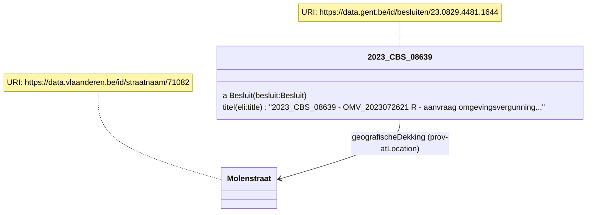

Om de link op te halen werd het SPARQL endpoint van Digitaal Vlaanderen gebruikt met [deze query](https://query.linkeddatafragments.org/#datasources=https%3A%2F%2Fdata.vlaanderen.be%2Fsparql&query=PREFIX%20adres%3A%20%3Chttps%3A%2F%2Fdata.vlaanderen.be%2Fns%2Fadres%23%3E%0APREFIX%20prov%3A%20%3Chttp%3A%2F%2Fwww.w3.org%2Fns%2Fprov%23%3E%0A%0ASELECT%20distinct%20*%0AWHERE%20%7B%0A%20%20%20%20%3Fstraatnaam%20a%20adres%3AStraatnaam%20%3B%0A%20%20%20%20%20%20%20rdfs%3Alabel%20%3Fstraatnaamlabel%20%3B%0A%20%20%20%20%20%20prov%3AwasAttributedTo%20%3Fgemeente%20.%0A%20%20%20%20%0A%20%20%20%20%20%20%20%3Fgemeentenaam%20adres%3AisAfgeleidVan%20%3Fgemeente%20%3B%0A%20%20%20%20%20%20%20%20%20%20%20%20%20%20%20rdfs%3Alabel%20%3Fgemeentelabel%20.%0A%20%20%20%20%20%20%0A%20%20%20%20%20%20FILTER%20(str(%3Fstraatnaamlabel)%20%3D%20%22Molenstraat%22)%0A%20%20%20%20%20%20FILTER%20(str(%3Fgemeentelabel)%20%3D%20%22Gent%22)%0A%7D).
Andere mogelijkheid is het gebruik van de [basisregisters Vlaanderen API](https://docs.basisregisters.vlaanderen.be/docs/api-documentation.html).

### Een adres

Bij adressen wordt gebruik gemaakt van [Adresvoorstellingen](https://data.vlaanderen.be/doc/applicatieprofiel/adresregister/#Adresvoorstelling) die op hun beurt verwijzen naar een adres in het basisregister.

```html
<div prefix="besluit: http://data.vlaanderen.be/ns/besluit# eli: http://data.europa.eu/eli/ontology# prov: http://www.w3.org/ns/prov# adres: https://data.vlaanderen.be/ns/adres# locn:http://www.w3.org/ns/locn#">
<div property="prov:generated" typeof="besluit:Besluit" resource="https://data.gent.be/id/besluiten/23.0829.4481.1644">
  <span property="eli:title" datatype="xsd:string">2023_CBS_08639 - OMV_2023072621 R - aanvraag omgevingsvergunning voor het verbouwen en uitbreiden van een eengezinswoning  - zonder openbaar onderzoek  - <span property="prov:atLocation" resource="https://data.gent.be/id/besluiten/23.0829.4481.1644/adresvoorstelling/1">Molenstraat 1</span>, 9032 Gent - Vergunning</span>
</div>
<div typeof="locn:Address" resource="https://data.gent.be/id/besluiten/23.0829.4481.1644/adresvoorstelling/1">
<span property="adres:Adresvoorstelling.huisnummer" content="1"></span>
<span property="adres:gemeentenaam" content="Gent" language="nl"></span>
<span property="locn:postcode" content="9000"></span>
<span property="locn:thoroughfare" content="Molenstraat"></span>
<span property="adres:verwijstNaar" content="https://data.vlaanderen.be/id/adres/3794238"></span>
</div>
</div>
```

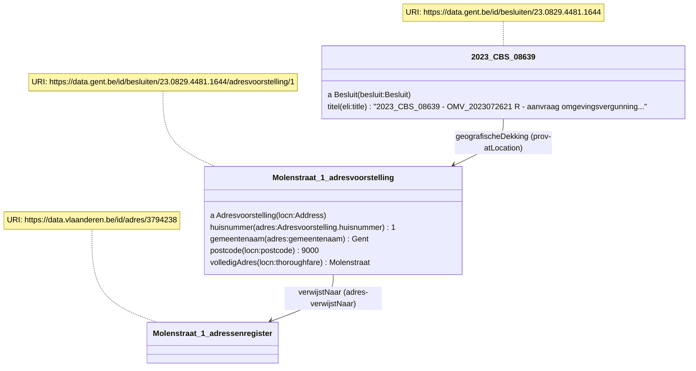

Het ophalen van een adres URI op basis van gemeentenaam, straatnaam en huisnummer werd met deze [query](https://query.linkeddatafragments.org/#datasources=https%3A%2F%2Fdata.vlaanderen.be%2Fsparql&query=PREFIX%20adres%3A%20%3Chttps%3A%2F%2Fdata.vlaanderen.be%2Fns%2Fadres%23%3E%0APREFIX%20prov%3A%20%3Chttp%3A%2F%2Fwww.w3.org%2Fns%2Fprov%23%3E%0A%0ASELECT%20distinct%20*%0AWHERE%20%7B%0A%20%20%09%3Fadres%20adres%3AheeftStraatnaam%20%3Fstraatnaam%20%3B%0A%20%20%20%20%20%20%20%20%20%20adres%3Ahuisnummer%20%3Fhuisnummer%20.%0A%20%20%0A%20%20%20%20%3Fstraatnaam%20a%20adres%3AStraatnaam%20%3B%0A%20%20%20%20%20%20%20rdfs%3Alabel%20%3Fstraatnaamlabel%20%3B%0A%20%20%20%20%20%20prov%3AwasAttributedTo%20%3Fgemeente%20.%0A%20%20%20%20%0A%20%20%20%20%20%20%20%3Fgemeentenaam%20adres%3AisAfgeleidVan%20%3Fgemeente%20%3B%0A%20%20%20%20%20%20%20%20%20%20%20%20%20%20%20rdfs%3Alabel%20%3Fgemeentelabel%20.%0A%20%20%20%20%20%20%0A%20%20%20%20%20%20FILTER%20(str(%3Fstraatnaamlabel)%20%3D%20%22Molenstraat%22)%0A%20%20%20%20%20%20FILTER%20(%3Fgemeentelabel%20%3D%20%22Gent%22)%0A%20%20%20%20%20%20BIND%20(str(%3Fhuisnummer)%20as%20%3Fhuisnummerstring)%0A%20%20%20%20%20%20FILTER%20(%3Fhuisnummerstring%20%3D%20%221%22)%0A%7D) gedaan.

### Combinatie van straat en huisnummers

Wanneer er meerdere huisnummers geannoteerd worden, raden we aan om elk adres apart te linken.
De adresvoorstellingen dienen apart beschreven te worden zoals hierboven getoond.

```html
<div prefix="besluit: http://data.vlaanderen.be/ns/besluit# eli: http://data.europa.eu/eli/ontology# prov: http://www.w3.org/ns/prov# adres: https://data.vlaanderen.be/ns/adres# locn:http://www.w3.org/ns/locn#">
<div property="prov:generated" typeof="besluit:Besluit" resource="https://data.gent.be/id/besluiten/23.0829.4481.1644">
  <span property="eli:title" datatype="xsd:string">2023_CBS_08639 - OMV_2023072621 R - aanvraag omgevingsvergunning voor het verbouwen en uitbreiden van een eengezinswoning  - zonder openbaar onderzoek  -
<span property="prov:atLocation" resource="https://data.gent.be/id/besluiten/23.0829.4481.1644/adresvoorstelling/1">Molenstraat 1</span>
<span property="prov:atLocation" resource="https://data.gent.be/id/besluiten/23.0829.4481.1644/adresvoorstelling/2"></span>
<span property="prov:atLocation" resource="https://data.gent.be/id/besluiten/23.0829.4481.1644/adresvoorstelling/3"></span>
tem
<span property="prov:atLocation" resource="https://data.gent.be/id/besluiten/23.0829.4481.1644/adresvoorstelling/4">10</span>
    , 9032 Gent - Vergunning</span>
</div>
</div>
```

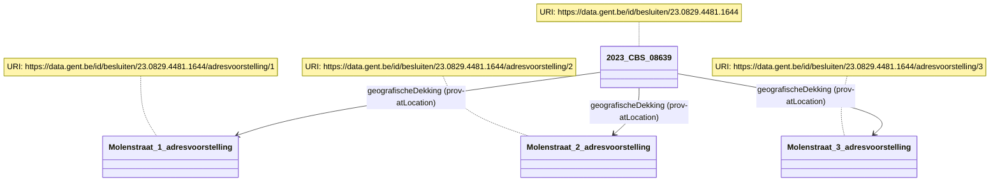

### Een plaats met naam en geometrie

Om een bepaalde plaats aan te duiden, zoals een wijk of evenementenweide, met een naam en geometrie kunnen we [Plaats](https://data.vlaanderen.be/doc/applicatieprofiel/generiek-basis/#Plaats) van OSLO generiek gebruiken.

```
<div prefix="besluit: http://data.vlaanderen.be/ns/besluit# eli: http://data.europa.eu/eli/ontology# prov: http://www.w3.org/ns/prov# adres: https://data.vlaanderen.be/ns/adres# locn: http://www.w3.org/ns/locn# rdfs: http://www.w3.org/2000/01/rdf-schema# geosparql: http://www.opengis.net/ont/geosparql#">
  <div property="prov:generated" typeof="besluit:Besluit" resource="https://data.gent.be/id/besluiten/23.0829.9225.8540">
    <span property="eli:title" datatype="xsd:string">2023_CBS_08501 - 15748/M/1 - Geluidsuitzending - op donderdag 21 september 2023 (Gentsterpop) op de
    <div property="prov:atLocation" typeof="locn:Location" resource="https://data.gent.be/id/besluiten/23.0829.9225.8540/plaats/1">
      <span property="rdfs:label">evenementenweide van de Blaarmeersen aan de Duiklaan te Gent</span>.
      <div property="locn:geometry" typeof="locn:Geometry" resource="https://data.gent.be/id/besluiten/23.0829.9225.8540/plaats/1/geometrie/1">
<span property="geosparql:asWKT" content="<http://www.opengis.net/def/crs/EPSG/0/31370> POINT(126306.58208223493 179948.9735279791)" datatype="geosparql:wktLiteral"></span>
      </div>
    </div>
  </div>
</div>
```

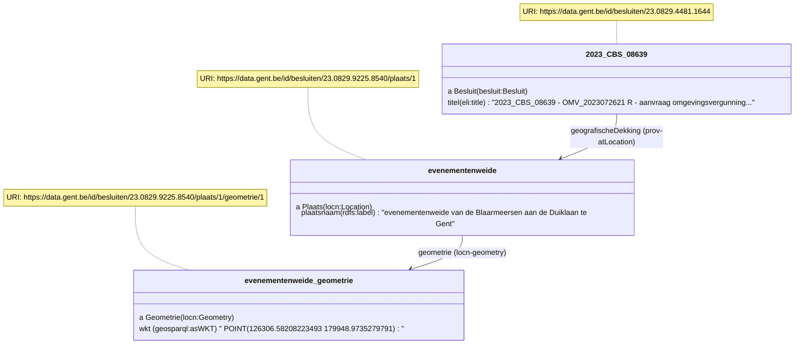

### Enkel coördinaten

Om enkel coördinaten te linken met het besluit, dient nog altijd met Geometrie gewerkt te worden.
Bijvoorbeeld: plaatsing van tijdelijke sluikstortcamera aan marktplein.
Dit voorbeeld toont het gebruik van een polygoon, maar [andere geometrieën](https://en.wikipedia.org/wiki/Well-known_text_representation_of_geometry) zijn ook mogelijk (linestring, multipolygon...)

```html
<div prefix="besluit: http://data.vlaanderen.be/ns/besluit# eli: http://data.europa.eu/eli/ontology# prov: http://www.w3.org/ns/prov# adres: https://data.vlaanderen.be/ns/adres# locn: http://www.w3.org/ns/locn# rdfs: http://www.w3.org/2000/01/rdf-schema# geosparql: http://www.opengis.net/ont/geosparql#">
  <div property="prov:generated" typeof="besluit:Besluit" resource="https://data.gent.be/id/besluiten/23.0829.9225.8540">
    <span property="eli:title" datatype="xsd:string">2023_CBS_1234 plaatsing van tijdelijke sluikstortcamera aan landweg></span>
      <div property="locn:geometry" typeof="locn:Geometry" resource="https://data.gent.be/id/besluiten/23.0829.9225.8540/geometrie/1">
<span property="geosparql:asWKT" content="<http://www.opengis.net/def/crs/EPSG/0/31370> POLYGON((3.856893014162779 50.92072191700282,3.8592103589326143 50.92070395170313,3.8592243567109112 50.9201614492234,3.857114547863603 50.92035642746691,3.856893014162779 50.92072191700282))" datatype="geosparql:wktLiteral"></span>
      </div>
    </div>
  </div>
</div>
```

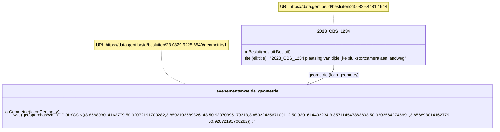

### Kadastrale gegevens

Om een besluit te linken met een bepaald perceel wordt de URI en objectidentificator (CaPaKey waarbij forward slash / vervangen werd door koppelteken) van het perceel bewaard.

Note voor ontwikkelaars: de URI kan opgehaald worden via de [basisregister API](https://docs.basisregisters.vlaanderen.be/docs/api-documentation.html#operation/GetParcelV2). Hiervoor dient de gebruiker wel de CaPaKey mee te geven.

```html
<div prefix="perceel: https://data.vlaanderen.be/ns/perceel# besluit: http://data.vlaanderen.be/ns/besluit# eli: http://data.europa.eu/eli/ontology# prov: http://www.w3.org/ns/prov# generiek: https://data.vlaanderen.be/ns/generiek#">
<div property="prov:generated" typeof="besluit:Besluit" resource="https://data.gent.be/id/besluiten/23.0829.4481.1644">
  <span property="eli:title" datatype="xsd:string">Overwegende dat het college akkoord ging met de locatie voor de PoP-cabine in Drieselken, kadastraal gekend als <span property="prov:atLocation" resource="https://data.vlaanderen.be/id/perceel/11001B0001-00S000">7de afdeling, sectie A, deel van nummer 892L</span></span>
</div>
<div typeof="https://data.vlaanderen.be/ns/perceel#Perceel" resource="https://data.vlaanderen.be/id/perceel/11001B0001-00S000">
<span property="generiek:lokaleIdentificator" content="11001B0009-00G004""></span>
</div>
</div>
```

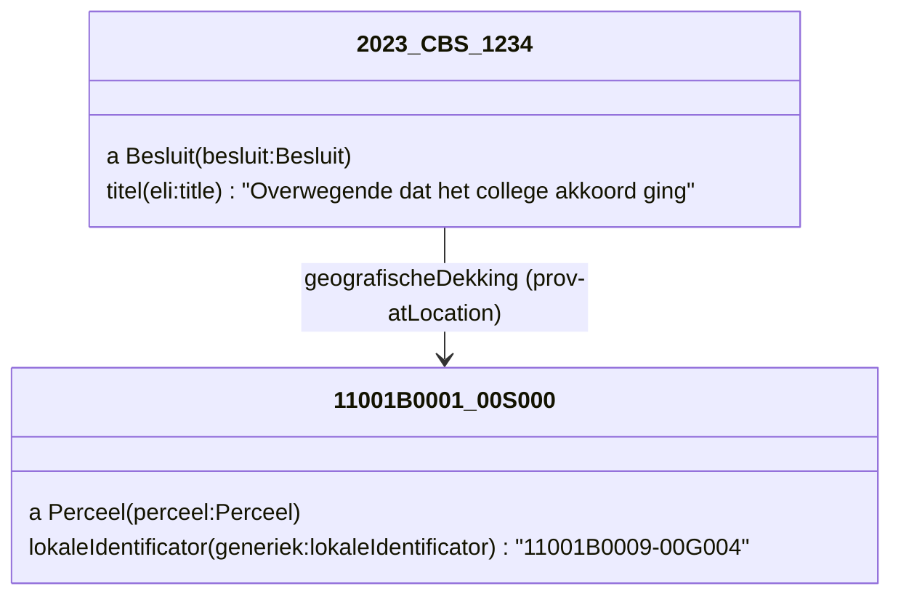

## Thema's

### Linken aan een thema

Hoofdthema's worden aangeboden via [deze codelijst](https://data.vlaanderen.be/doc/conceptscheme/BesluitThema).
Bijvoorbeeld `https://data.vlaanderen.be/id/concept/BesluitThema/30584583-800a-4c37-8ef8-e85140cc471a` voor het thema Cultuur en vrije tijd.
De bedoeling is dat deze hoofdthema's gekoppeld worden met diverse rapporteringen zoals BBC en stadsmonitor.

De relatie `dcterms:subject` wordt gebruikt om de link tussen het besluit en het thema te maken:
```html
<div prefix="sro: https://data.vlaanderen.be/ns/slimmeraadpleegomgeving# besluit: http://data.vlaanderen.be/ns/besluit# prov: http://www.w3.org/ns/prov# eli: http://data.europa.eu/eli/ontology# dcterms: http://purl.org/dc/terms/ adres: https://data.vlaanderen.be/ns/adres# locn: http://www.w3.org/ns/locn# rdfs: http://www.w3.org/2000/01/rdf-schema# geosparql: http://www.opengis.net/ont/geosparql#">
  <div property="prov:generated" typeof="besluit:Besluit" resource="https://data.aalter.be/id/besluiten/23.1010.7267.2954">
    <span property="eli:title" datatype="xsd:string">Goedkeuring dienstverlening: Terrasvergunning - Inname openbaar domein</span>
    <span property="dcterms:subject" resource="https://data.vlaanderen.be/id/concept/BesluitThema/30584583-800a-4c37-8ef8-e85140cc471a"></span>
  </div>
</div>
```
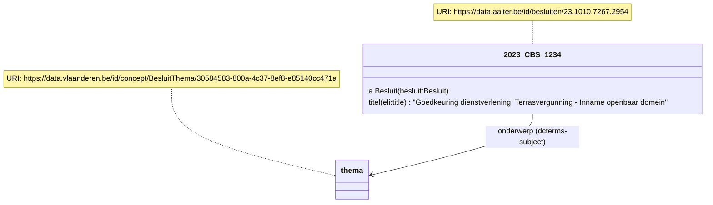


### Subthema's definiëren

Lokaal kunnen er specifiekere thema's gebruikt worden. Hierbij dient een relatie `skos:broader` of `skos:related` voorzien te worden naar een hoofdthema uit de codelijst van hierboven.

```html
<div prefix="sro: https://data.vlaanderen.be/ns/slimmeraadpleegomgeving# besluit: http://data.vlaanderen.be/ns/besluit# prov: http://www.w3.org/ns/prov# eli: http://data.europa.eu/eli/ontology# dcterms: http://purl.org/dc/terms/ adres: https://data.vlaanderen.be/ns/adres# locn: http://www.w3.org/ns/locn# rdfs: http://www.w3.org/2000/01/rdf-schema# geosparql: http://www.opengis.net/ont/geosparql#" skos: http://www.w3.org/2004/02/skos/core#>
  <div property="prov:generated" typeof="besluit:Besluit" resource="https://data.aalter.be/id/besluiten/23.1010.7267.2954">
    <span property="eli:title" datatype="xsd:string">Goedkeuring dienstverlening: Terrasvergunning - Inname openbaar domein</span>
    <div property="dcterms:subject" resource="https://data.aalter.be/id/concept/besluitthema/terrasvergunning" typeof="skos:Concept">
      <span property="skos:prefLabel" content="Terrasverguning (thema)"></span>
      <span property="skos:definition" content="Dit thema gaat over terrasvergunningen - inname openbaar domein"></span>
      <span property="skos:broader skos:related" resource="https://data.vlaanderen.be/id/concept/BesluitThema/30584583-800a-4c37-8ef8-e85140cc471a"></span>
    </div>
  </div>
</div>
```
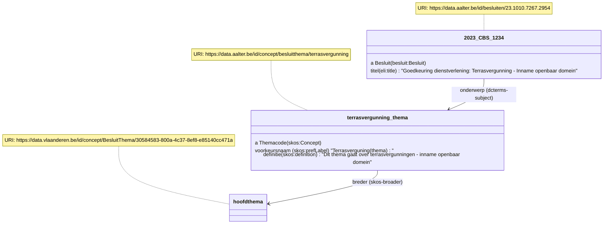

## LPDC-codes

Om te verwijzen naar een LPDC/IPDC-code wordt er verwezen naar een URI, zoals `https://ipdc.vlaanderen.be/id/instantie/27543`.

Het voorbeeld hieronder legt de "bekrachtigt"-relatie tussen een besluit en het LPDC product (instantie van een conceptual public service).
```html
<div prefix="ipdc-lpdc: https://productencatalogus.data.vlaanderen.be/ns/ipdc-lpdc# sro: https://data.vlaanderen.be/ns/slimmeraadpleegomgeving# besluit: http://data.vlaanderen.be/ns/besluit# eli: http://data.europa.eu/eli/ontology# dcterms: http://purl.org/dc/terms/ adres: https://data.vlaanderen.be/ns/adres# locn: http://www.w3.org/ns/locn# rdfs: http://www.w3.org/2000/01/rdf-schema# geosparql: http://www.opengis.net/ont/geosparql#">
  <div property="prov:generated" typeof="besluit:Besluit" resource="https://data.aalter.be/id/besluiten/23.1010.7267.2954">
    <span property="eli:title" datatype="xsd:string">Goedkeuring dienstverlening: Terrasvergunning - Inname openbaar domein</span>
    <div property="sro:bekrachtigt" resource="https://ipdc.vlaanderen.be/id/instantie/27543" typeof="ipdc-lpdc:InstancePublicService">
      <span property="dcterms:source" resource="https://ipdc.vlaanderen.be/id/concept/1234"></span>
    </div>
  </div>
</div>
```

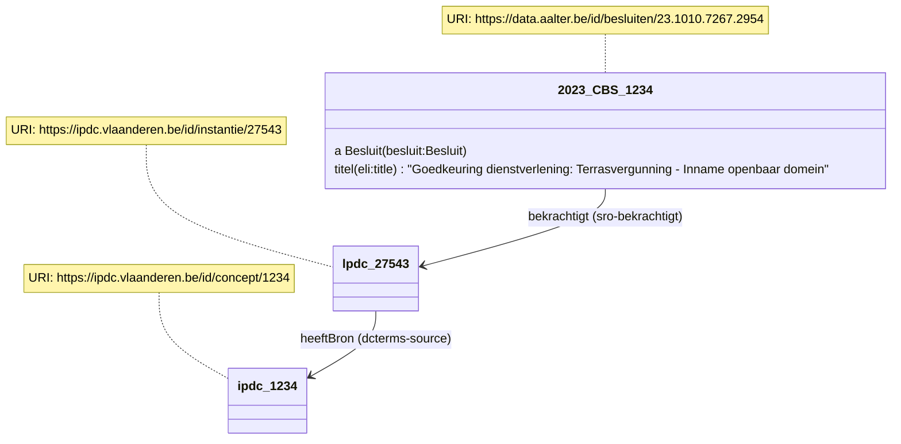

## Gecoördineerde versies van reglementen als bijlage van een besluit

We volgen hiervoor de documentatie op de [vendor pagina's](https://lblod.github.io/pages-vendors/#/docs/decision-attachments
), mits uitbreiding:

* de behandeling van agendapunt wordt gelinkt met `prov:generated` met 2 besluiten: het wijzigingsbesluit + gecoördineerde reglement
* Het gecoördineerde reglement krijgt een type `gecoördineerd reglement` (work in progress om dit toe te voegen)
* Het gecoördineerde reglement *consolideert* de vorige versie van het gecoördineerde reglement en zijn wijzigingsbesluiten
* Uitbreiding: naast het linken van de 2 besluiten met `eli:related` en `dcterms:isPartOf`, wordt ook `eli:consolidates` en `eli:consolidated_by` gebruikt

Nota:
* het reglement zou een rechtsgrond URI moeten hebben dat niet verandert over de tijd en gebruikt kan worden om alle versies te bundelen
* telkens een nieuwe versie van het gecoördineerde reglement gemaakt wordt, dient een nieuwe URI (URL) aangemaakt te worden voor de specifieke versie

```html
<div prefix="sro: https://data.vlaanderen.be/ns/slimmeraadpleegomgeving# besluit: http://data.vlaanderen.be/ns/besluit# eli: http://data.europa.eu/eli/ontology# dcterms: http://purl.org/dc/terms/ adres: https://data.vlaanderen.be/ns/adres# locn: http://www.w3.org/ns/locn# rdfs: http://www.w3.org/2000/01/rdf-schema# geosparql: http://www.opengis.net/ont/geosparql#">
  <div typeof="besluit:BehandelingVanAgendapunt" resource="https://data.aalter.be/id/behandelingen-van-agendapunten/23.1010.7267.2954">
  <div property="prov:generated" typeof="besluit:Besluit" resource="https://data.aalter.be/id/besluiten/23.1010.7267.2954">
    <span property="eli:title" datatype="xsd:string">2023_CBS_02161 - Collegebeslissing betreffende de wijziging van het arbeidsreglement van het deeltijds kunstonderwijs</span>
    <span property="eli:related eli:consolidated_by" rev="dcterms:isPartOf eli:consolidates" resource="https://www.aalter.be/File/Download/30162/57A22F13C4F05BE09DFA919C0503321B" typeof="besluit:Besluit"></span>
  </div>
  <div property="prov:generated" typeof="besluit:Besluit" resource="https://www.aalter.be/File/Download/30162/57A22F13C4F05BE09DFA919C0503321B">
      <span property="rdf:type" content="https://data.vlaanderen.be/id/concept/BesluitDocumentType/GecoördineerdReglement"></span>
      <span property="eli:title" datatype="xsd:string" content="Het gewijzigde arbeidsreglement voor de Academie voor muziek, woord en dans"></span>
      <div property="eli:realizes" content="https://data.aalter.be/id/rechtsgrond/12.1234.1234.1234" typeof="eli:LegalResource">
        <span property="eli:type_document" content="https://data.vlaanderen.be/id/concept/BesluitDocumentType/Arbeidsreglement"></span>
      </div>
  </div>
    </div>
</div>
</div>
```

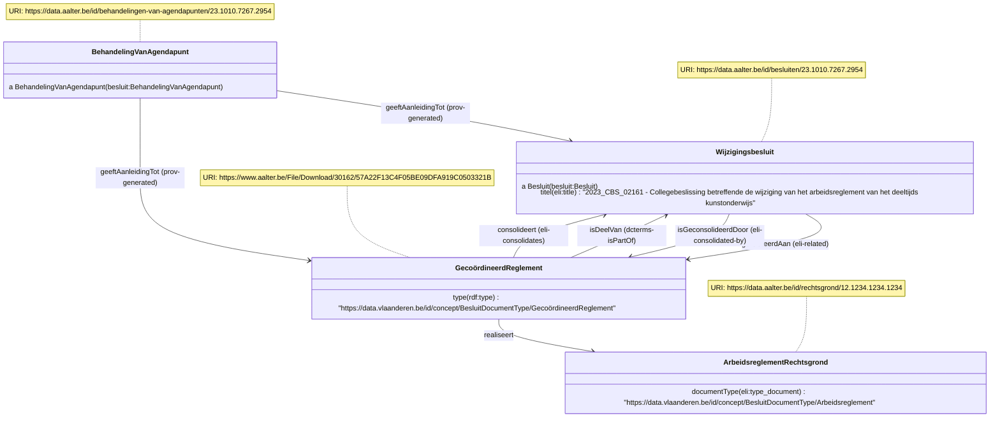

## besluiten in mijn directe leefomgeving, de school van mijn kinderen, de buurt waar ik dikwijls vertoef, de leefomgeving van een familielid, de omgeving van een pand dat in mijn bezit is, een traject waar ik dikwijls langs rijd, …)

Dankzij het applicatieprofiel slimme raadpleegomgeving kunnen besturen hun besluiten linken aan locaties zoals gedefinieerd in [Locatie-gebaseerde informatie](#locatie-gebaseerde-informatie). Voor deze use case gaan we er van uit dat het besluit rechstreeks wordt gelinkt aan de locatie, dit kan bijvoorbeeld met de rdfa-editor van agentschap binnenlands bestuur.


dit resulteert in volgende geannoteerde html:
```html
<div class="say-editable" about="http://data.lblod.info/id/besluiten/4f3b371f-dcc2-4de7-9bb9-62c2cf37ddb6" typeof="http://data.vlaanderen.be/ns/besluit#Besluit">
  <span resource="https://publicatie.gelinkt-notuleren.vlaanderen.be/id/plaats/3c876c1c-628f-4535-a73f-ce1f3783f669" typeof="http://www.w3.org/ns/locn#Location" property="prov:atLocation">
    <span property="http://www.w3.org/2000/01/rdf-schema#label">ingang parking kerkhoflaan</span><span property="http://www.w3.org/ns/locn#geometry" resource="https://publicatie.gelinkt-notuleren.vlaanderen.be/id/geometrie/d0d9d9b3-1d94-48b3-9bfc-166e0e0c23e0" typeof="http://www.w3.org/ns/locn#Geometry">
      <span property="http://www.opengis.net/ont/geosparql#asWKT" datatype="http://www.opengis.net/ont/geosparql#wktLiteral" content="<http://www.opengis.net/def/crs/EPSG/0/31370> POINT(126306.58208223493 179948.9735279791)"></span>
    </span>
  </span>
</div>
```

Het is dan mogelijk om aan de hand van een GeoSPARQL relevante besluiten voor een bepaalde buurt te vinden:

```sparql
PREFIX besluit: <http://example.org/besluit#>
PREFIX prov: <http://www.w3.org/ns/prov#>
PREFIX geosparql: <http://www.opengis.net/ont/geosparql#>
<http://www.opengis.net/def/crs/EPSG/0/31370>
SELECT ?besluit ?wkt
WHERE {
  ?besluit a besluit:Besluit .
  ?besluit prov:atLocation/prov:geometry/geosparql:asWKT ?wkt .
  BIND("<http://www.opengis.net/def/crs/EPSG/0/31370> POLYGON((x1 y1, x2 y2, x3 y3, x4 y4, x1 y1))"^^geosparql:wktLiteral AS ?polygon) .
  # Check if the point is within the polygon
  FILTER(geosparql:sfWithin(?wkt, ?polygon)) .
}
```

## Zoeken adhv woorden in besluiten

Dit is een functionaliteit dat ingebouwd moet worden in raadpleegomgevingen en staat los van het model.
Bijvoorbeeld bij: [Green Valley](https://raadpleeg-aalter.onlinesmartcities.be/zoeken?query=pakjesautomaat&organId=&meetingDateStart=&meetingDateEnd=&typeId=&title=&page=0&pageSize=10) en [Lokaal Beslist](https://lokaalbeslist.lblod.info/agendapunten?gemeentes=Aalter&trefwoord=pakjesautomaat).

## Drones boven mijn gemeente. Is dit toegestaan?

Om de inhoud van besluiten gedetailleerd te ontsluiten (welke actoren, objecten, locaties) wordt er gekeken naar OSLO Omgevingsvergunning. Hier worden toelating gemodelleerd met Normatieve Bepalingen en Activiteiten.

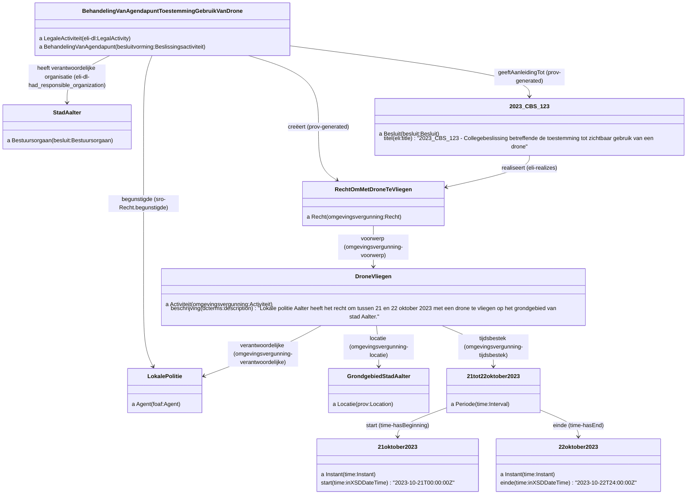

## Ontwerpbesluit

Ontwerpbesluit principieel goedgekeurd op college, ter goedkeuring op gemeenteraad.

- Het college heeft een agendapunt om ontwerpbesluit voor de gemeenteraad principieel goed te keuren. Dit leidt tot een besluit met als bijlage het ontwerpbesluit.
- Het ontwerpbesluit kan gezien worden als een bijlage bij het besluit dat het ontwerp principieel goedkeurt op het college van burgemeester en schepenen. Voor deze relatie wordt [eli:related_to](http://data.europa.eu/eli/ontology#related_to) gebruikt.
- Het ontwerpbesluit is een stuk, dit kan nog eens extra aangegeven worden via de [dc:type](http://purl.org/dc/terms/type) relatie
- De gemeenteraad heeft een agendapunt om het ontwerpbesluit goed te keuren. De goedkeuring van het ontwerpbesluit op de gemeenteraad geeft aanleiding ([prov:generated](http://www.w3.org/ns/prov#generated)) tot een besluit.
- Dit besluit kan gelinkt worden aan het ontwerp via de relatie was gebaseerd op ([prov:wasDerivedFrom](http://www.w3.org/ns/prov#wasDerivedFrom)).
- De behandeling van het agendapunt "gebruikte" ([prov:used](http://www.w3.org/ns/prov#used)) het ontwerpbesluit als input.

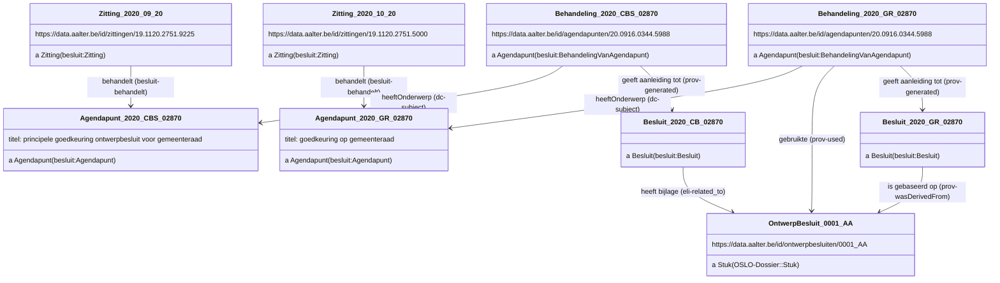

### Stuk (bv Gebruikersbevraging) als input voor besluit
We zoomen hier nog even in op het gebruik van stukken als input voor een besluit. De relaties in dit voorbeeld worden ook gebruikt in de use case [Ontwerpbesluit](#Ontwerpbesluit), maar kunnen voor elk type stuk gebruikt worden.
Als een besluit wordt gemotiveerd door ondersteunende stukken kunnen deze worden gelinkt via de relatie [`gebruikte`](http://www.w3.org/ns/prov#used). Daarnaast kunnen legislatieve activiteiten aan elkaar gelinkt worden via de relatie [`wasGemotiveerdDoor`](http://data.europa.eu/eli/eli-draft-legislation-ontology#was_motivated_by).
In het voorbeeld hieronder worden de resultaten van een gebruikersbevraging gebruikt in de gemeenteraad om een besluit te motiveren.


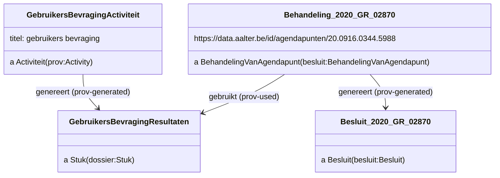

## Initiatiefrecht

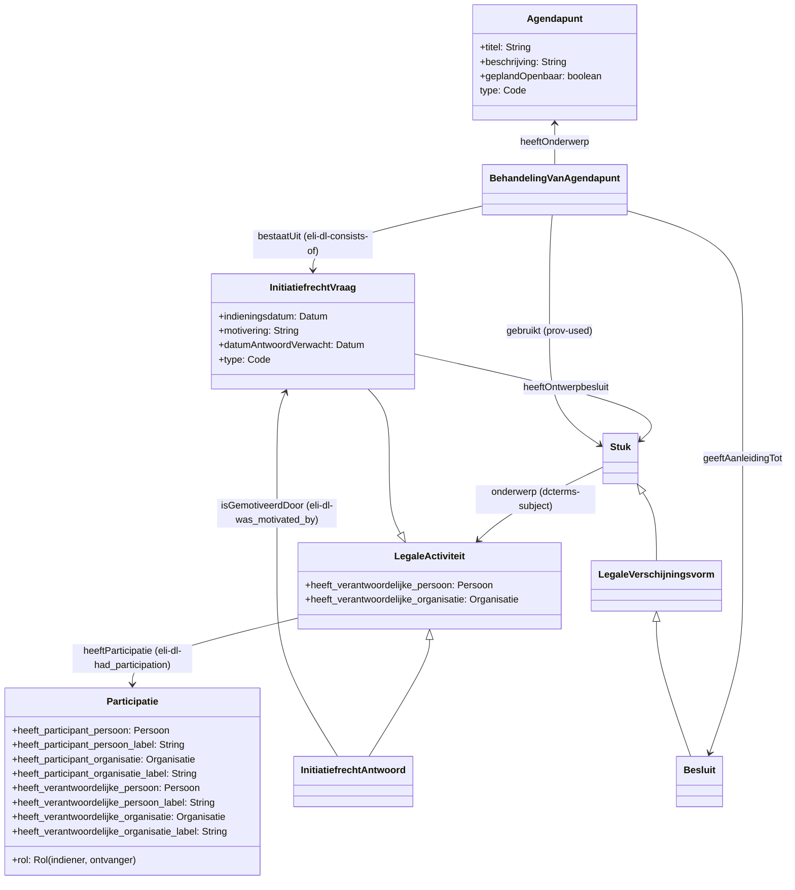

### Vraag en schriftelijk antwoord tijdens zitting

```html
<div prefix="rdf: http://www.w3.org/1999/02/22-rdf-syntax-ns# dctypes: http://purl.org/dc/dcmitype/ persoon: http://data.vlaanderen.be/ns/persoon# foaf: http://xmlns.com/foaf/0.1/ eli-dl: http://data.europa.eu/eli/eli-draft-legislation-ontology# sro: https://data.vlaanderen.be/ns/slimmeraadpleegomgeving# besluit: http://data.vlaanderen.be/ns/besluit# eli: http://data.europa.eu/eli/ontology# dcterms: http://purl.org/dc/terms/ adres: https://data.vlaanderen.be/ns/adres# locn: http://www.w3.org/ns/locn# rdfs: http://www.w3.org/2000/01/rdf-schema# geosparql: http://www.opengis.net/ont/geosparql# prov: http://w3.org/ns/prov#">
  <div typeof="besluit:BehandelingVanAgendapunt" resource="https://data.aalter.be/id/behandelingen-van-agendapunten/23.1010.7267.2954">
    <div property="dcterms:subject" resource="https://data.aalter.be/id/agendapunten/23.1010.7267.2954">
      <span property="dcterms:title">2023_SV_00440 - Opvolging onteigeningsprocedure Spoorwegbosje - bevoegde...></span>
    </div>
    <div property="eli-dl:consists-of" resource="https://data.aalter.be/id/behandelingen-van-agendapunten/23.1010.7267.2954/activiteit/1" typeof="sro:InitiatiefrechtVraag">
      <span property="prov:value">Toelichting
Thuispunt Gent (TPG) kondigde vorig jaar een onteigeningsprocedure - gericht naar de NMBS - aan
om bijkomende gronden te verwerven voor de bouw van sociale woningen, meer bepaald voor het
Spoorwegbosje. De NMBS reageerde hierop door een rechtszaak te openen tegen TPG en de Stad
Gent. In juli werd via de pers bekend gemaakt dat de NMBS ongelijk had en TPG de grond mag
onteigenen van de rechter. Intussen zou de NMBS gereageerd hebben met een beroepsprocedure
tegen deze uitspraak om de onteigening tegen te houden.
De PVDA-fractie heeft daarover volgende vragen:
Vraag
Wat is de reactie van het stadsbestuur op de aangekondigde beroepsprocedure van de NMBS?
Welk bijkomende stappen zal het stadsbestuur zetten om de verwerving/onteigening van het
Spoorwegbosje alsnog te realiseren voordat NMBS een private verkoop zou laten doorgaan?
Zal het stadsbestuur contact opnemen met de bevoegde federale minister(s) om de verwerving van
het Spoorwegbosje te realiseren via onteigening?</span>
      <div property="eli-dl:had_participation" resource="https://data.aalter.be/id/behandelingen-van-agendapunten/23.1010.7267.2954/activiteit/1/participatie/1">
        <span property="eli-dl:had_participant_person" resource="http://data.lblod.info/id/mandatarissen/5C389E2E57753A000A00031B"></span>
        <span property="eli-dl:participant_person_label">De Meester Tom (PVDA)</span>
        <div property="eli-dl:role" resource="https://data.aalter.be/id/behandelingen-van-agendapunten/23.1010.7267.2954/activiteit/1/participatie/rol/1">
          <span property="skos:prefLabel">raadslid</span>
        </div>
      </div>
      <div property="eli-dl:had_participation" resource="https://data.aalter.be/id/behandelingen-van-agendapunten/23.1010.7267.2954/activiteit/1/participatie/2">
        <span property="eli-dl:participant_person_label">Voornaam achternaam</span>
        <div property="eli-dl:had_participant_person" resource="https://data.aalter.be/id/behandelingen-van-agendapunten/23.1010.7267.2954/activiteit/1/participatie/2/persoon/1">
          <span property="persoon:gebruikteVoornaam" content="Voornaam van iemand"></span>
          <span property="foaf:familyName" content="Achternaam van iemand"></span>
        </div>
      </div>
    </div>
    <div property="eli-dl:consists-of" resource="https://data.aalter.be/id/behandelingen-van-agendapunten/23.1010.7267.2954/activiteit/2" typeof="sro:InitiatiefrechtAntwoord">
      <div property="eli-dl:had_participation" resource="https://data.aalter.be/id/behandelingen-van-agendapunten/23.1010.7267.2954/activiteit/2/participatie/1">
          <span property="eli-dl:had_participant_person" resource="https://data.lblod.info/id/mandatarissen/628E3F70470F7A0008000128"></span>
          <span property="eli-dl:participant_person_label">bevoegd schepen Tine Heyse</span>
          <div property="eli-dl:role" resource="https://data.aalter.be/id/behandelingen-van-agendapunten/23.1010.7267.2954/activiteit/2/participatie/rol/1">
            <span property="skos:prefLabel">bevoegd schepen</span>
          </div>
      </div>
      <span property="prov:value">Wij betreuren hoe dan ook dat we voor dit dossier in een juridisch dispuut zijn beland. De rechter
heeft geoordeeld dat Thuispunt in deze zaak de juiste stappen en procedure heeft gevolgd en dat
ook de stad hierin geen fouten heeft gemaakt.
De NMBS denkt daar anders over en heeft intussen beroep aangetekend, zowel tegen Thuispunt
Gent als tegen Stad Gent. De Stad Gent is niet gedagvaard in de hoedanigheid van onteigenende
overheid, maar in het kader van een aansprakelijkheids- vordering (eis tot schadevergoeding).
Thuispunt Gent treedt in deze zaak op als onteigend bestuur, zodat de Stad Gent zelf geen
bijkomende stappen zal zetten wat betreft de onteigeningsprocedure.
Thuispunt Gent kan de bestuurlijke fase waarbij het onteigeningsplan wordt opgemaakt verder
zetten, en het is aan Thuispunt Gent om – in de loop van de bestuurlijke fase – de federale Minister
te bevragen naar een machtiging om de NMBS te mogen onteigenen.
U heeft de stand van zaken van dit dossier aan de kant van Thuispunt Gent ook rechtstreeks aan hen
kunnen vragen op de themacommissie van vorige week. Zij hebben u daar ook op geantwoord.</span>
    </div>
  </div>
</div>
```

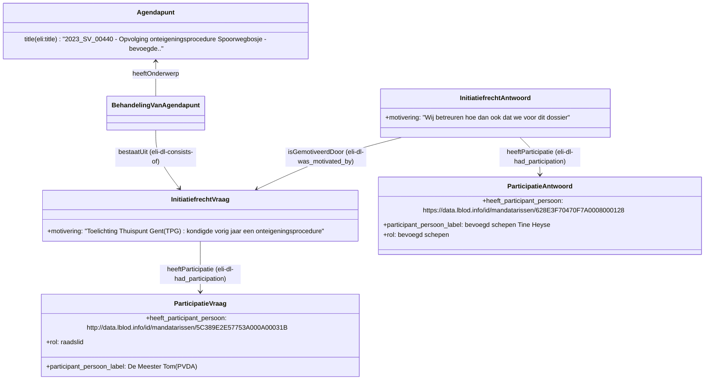

### mondeling antwoord in video-opname

Zelfde zitting, agendapunt en vraag als hierboven, maar waarbij het antwoord in een video-opname staat.

### Videoplayer

```html
<div typeof="besluit:BehandelingVanAgendapunt" resource="https://data.aalter.be/id/behandelingen-van-agendapunten/23.1010.7267.2954">
  <div property="eli-dl:consists-of" resource="https://data.aalter.be/id/behandelingen-van-agendapunten/23.1010.7267.2954/activiteit/1" typeof="sro:InitiatiefrechtVraag">
        <span property="prov:value">Toelichting
  Thuispunt Gent (TPG) kondigde vorig jaar een onteigeningsprocedure - gericht naar de NMBS - aan...</span>
  </div>
  <div property="eli-dl:consists-of" resource="https://data.aalter.be/id/behandelingen-van-agendapunten/23.1010.7267.2954/activiteit/2" typeof="sro:InitiatiefrechtAntwoord">
    <div property="eli-dl:recorded_in_realization_of" resource="https://data.aalter.be/id/behandelingen-van-agendapunten/23.1010.7267.2954/activiteit/2/werk">
      <div rev="eli:realizes" resource="https://sdk.companywebcast.com/sdk/player/?id=stadgent_20231023_2&offsets=2023-10-22T17:09:50Z,2023-10-23T20:00:15Z" typeof="dctypes:MovingImage">
        <span property="oa:source" resource="https://sdk.companywebcast.com/sdk/player/?id=stadgent_20231023_2"></span>
      </div>
    </div>
  </div>
</div>
```

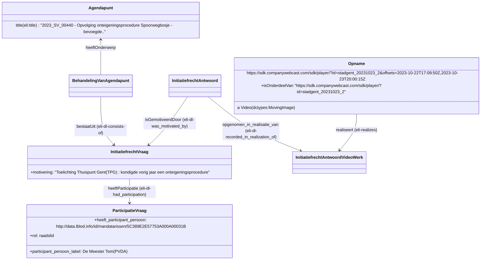


### Youtube

```html
<div typeof="besluit:BehandelingVanAgendapunt" resource="https://data.aalter.be/id/behandelingen-van-agendapunten/23.1010.7267.2954">
  <div property="eli-dl:consists-of" resource="https://data.aalter.be/id/behandelingen-van-agendapunten/23.1010.7267.2954/activiteit/1" typeof="sro:InitiatiefrechtVraag">
        <span property="prov:value">Toelichting
  Thuispunt Gent (TPG) kondigde vorig jaar een onteigeningsprocedure - gericht naar de NMBS - aan...</span>
  </div>
  <div property="eli-dl:consists-of" resource="https://data.aalter.be/id/behandelingen-van-agendapunten/23.1010.7267.2954/activiteit/2" typeof="sro:InitiatiefrechtAntwoord">
    <div property="eli-dl:recorded_in_realization_of" resource="https://data.aalter.be/id/behandelingen-van-agendapunten/23.1010.7267.2954/activiteit/2/werk">
      <div rev="eli:realizes" resource="https://www.youtube.com/watch?v=SBWocOBTKrg#t=30,60">
        <span property="oa:source" resource="https://www.youtube.com/watch?v=SBWocOBTKrg"></span>
        <div property="oa:hasSelector" resource="https://data.aalter.be/id/behandelingen-van-agendapunten/23.1010.7267.2954/activiteit/2/selector/1" typeof="oa:FragmentSelector">
                <span property="oa:conformsTo" resource="http://www.w3.org/TR/media-frags/"></span>
                <span property="rdf:value" content="t=30,60"></span>
        </div>
      </div>
    </div>
  </div>
</div>
```

### Schriftelijke vraag en antwoord, niet op zitting

```html
<div prefix="rdf: http://www.w3.org/1999/02/22-rdf-syntax-ns# dctypes: http://purl.org/dc/dcmitype/ persoon: http://data.vlaanderen.be/ns/persoon# foaf: http://xmlns.com/foaf/0.1/ eli-dl: http://data.europa.eu/eli/eli-draft-legislation-ontology# sro: https://data.vlaanderen.be/ns/slimmeraadpleegomgeving# besluit: http://data.vlaanderen.be/ns/besluit# eli: http://data.europa.eu/eli/ontology# dcterms: http://purl.org/dc/terms/ adres: https://data.vlaanderen.be/ns/adres# locn: http://www.w3.org/ns/locn# rdfs: http://www.w3.org/2000/01/rdf-schema# geosparql: http://www.opengis.net/ont/geosparql# prov: http://w3.org/ns/prov#">
  <div resource="https://data.aalter.be/id/schriftelijkevraag/23.1010.7267.2954" typeof="sro:InitiatiefrechtVraag">
    <span property="sro:Iniatiefrecht.type" resource="https://data.vlaanderen.be/id/concept/Initiatiefrecht/SchriftelijkeVraag"></span>
    <span property="prov:value">Toelichting
      Thuispunt Gent (TPG) kondigde vorig jaar een onteigeningsprocedure - gericht naar de NMBS - aan
      om bijkomende gronden te verwerven voor de bouw van sociale woningen, meer bepaald voor het
      Spoorwegbosje. De NMBS reageerde hierop door een rechtszaak te openen tegen TPG en de Stad
      Gent. In juli werd via de pers bekend gemaakt dat de NMBS ongelijk had en TPG de grond mag
      onteigenen van de rechter. Intussen zou de NMBS gereageerd hebben met een beroepsprocedure
      tegen deze uitspraak om de onteigening tegen te houden.
      De PVDA-fractie heeft daarover volgende vragen:
      Vraag
      Wat is de reactie van het stadsbestuur op de aangekondigde beroepsprocedure van de NMBS?
      Welk bijkomende stappen zal het stadsbestuur zetten om de verwerving/onteigening van het
      Spoorwegbosje alsnog te realiseren voordat NMBS een private verkoop zou laten doorgaan?
      Zal het stadsbestuur contact opnemen met de bevoegde federale minister(s) om de verwerving van
      het Spoorwegbosje te realiseren via onteigening?</span>
      <div property="eli-dl:had_participation" resource="https://data.aalter.be/id/schriftelijkevraag/23.1010.7267.2954/participatie/1">
        <span property="eli-dl:had_participant_person" resource="http://data.lblod.info/id/mandatarissen/5C389E2E57753A000A00031B"></span>
        <span property="eli-dl:participant_person_label">De Meester Tom (PVDA)</span>
        <div property="eli-dl:role" resource="https://data.aalter.be/id/behandelingen-van-agendapunten/23.1010.7267.2954/activiteit/1/participatie/rol/1">
          <span property="skos:prefLabel">raadslid</span>
        </div>
      </div>
      <div property="eli-dl:had_participation" resource="https://data.aalter.be/id/behandelingen-van-agendapunten/23.1010.7267.2954/activiteit/1/participatie/2">
        <span property="eli-dl:participant_person_label">Voornaam achternaam</span>
        <div property="eli-dl:had_participant_person" resource="https://data.aalter.be/id/behandelingen-van-agendapunten/23.1010.7267.2954/activiteit/1/participatie/2/persoon/1">
          <span property="persoon:gebruikteVoornaam" content="Voornaam van iemand"></span>
          <span property="foaf:familyName" content="Achternaam van iemand"></span>
        </div>
      </div>
    </div>
    <div resource="https://data.aalter.be/id/schriftelijkantwoord/23.1010.7267.2954" typeof="sro:InitiatiefrechtAntwoord">
      <span property="sro:Iniatiefrecht.type" resource="https://data.vlaanderen.be/id/concept/Initiatiefrecht/SchriftelijkAntwoord"></span>
      <div property="eli-dl:had_participation" resource="https://data.aalter.be/id/behandelingen-van-agendapunten/23.1010.7267.2954/activiteit/2/participatie/1">
        <span property="eli-dl:had_participant_person" resource="https://data.lblod.info/id/mandatarissen/628E3F70470F7A0008000128"></span>
        <span property="eli-dl:participant_person_label">bevoegd schepen Tine Heyse</span>
        <div property="eli-dl:role" resource="https://data.aalter.be/id/behandelingen-van-agendapunten/23.1010.7267.2954/activiteit/2/participatie/rol/1">
          <span property="skos:prefLabel">bevoegd schepen</span>
        </div>
        <span property="prov:value">Wij betreuren hoe dan ook dat we voor dit dossier in een juridisch dispuut zijn beland. De rechter
          heeft geoordeeld dat Thuispunt in deze zaak de juiste stappen en procedure heeft gevolgd en dat
          ook de stad hierin geen fouten heeft gemaakt.
          De NMBS denkt daar anders over en heeft intussen beroep aangetekend, zowel tegen Thuispunt
          Gent als tegen Stad Gent. De Stad Gent is niet gedagvaard in de hoedanigheid van onteigenende
          overheid, maar in het kader van een aansprakelijkheids- vordering (eis tot schadevergoeding).
          Thuispunt Gent treedt in deze zaak op als onteigend bestuur, zodat de Stad Gent zelf geen
          bijkomende stappen zal zetten wat betreft de onteigeningsprocedure.
          Thuispunt Gent kan de bestuurlijke fase waarbij het onteigeningsplan wordt opgemaakt verder
          zetten, en het is aan Thuispunt Gent om – in de loop van de bestuurlijke fase – de federale Minister
          te bevragen naar een machtiging om de NMBS te mogen onteigenen.
          U heeft de stand van zaken van dit dossier aan de kant van Thuispunt Gent ook rechtstreeks aan hen
          kunnen vragen op de themacommissie van vorige week. Zij hebben u daar ook op geantwoord.</span>
        </div>
      </div>
    </div>
```


## Annotaties

### Besluit annoteren met resource (locatie)

In dit voorbeeld annoteren we een besluit met het adres Molenstraat 1, Gent.
De annotatie gaat over het besluit en heeft het adres als "body".

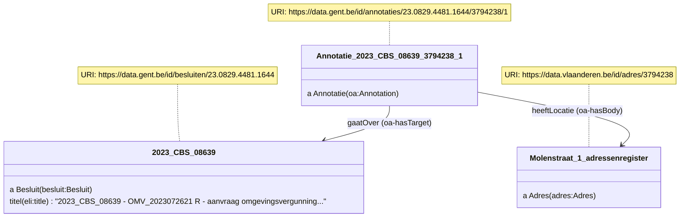

### Tekstpositieselector

Om te kunnen weten waar het adres exact voorkomt in het besluit moeten we dit stuk in de tekst van het besluit kunnen afbakenen.
Hiervoor kan een tekstpositieselector gebruikt worden dat een stuk tekst afbakent met "start" en "einde".
In ons voorbeeld voegen we een ResourceOnderdeel toe dat refereert naar het besluit en de selector. 

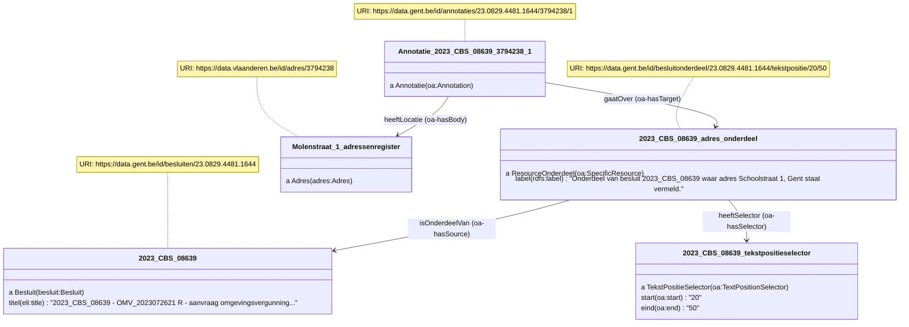

### SHACLpathselector

Een besluit heeft meerdere eigenschappen waar tekst in staat, bijvoorbeeld de titel, beschrijving, motivering en inhoud.
De Tekstpositieselector laat niet toe om te specifiëren welke tekst-eigenschap gebruikt wordt.
Hiervoor gebruiken we de SHACLpathselector dat dient als een verfijning van de Tekstpositieselector om de ResourceOnderdeel nog duidelijker af te bakenen.

In het voorbeeld voegen we een "verfijndDoor" relatie toe van de Tekstpositieselector naar de Shaclpathselector. 
Zo beschrijven we dat de Tekstpositieselector toegepast moet worden op de inhoud-eigenschap van het besluit.
Meer info over SHACL property paths kan in de [SHACL specificatie](https://www.w3.org/TR/shacl/#property-paths) gevonden worden.

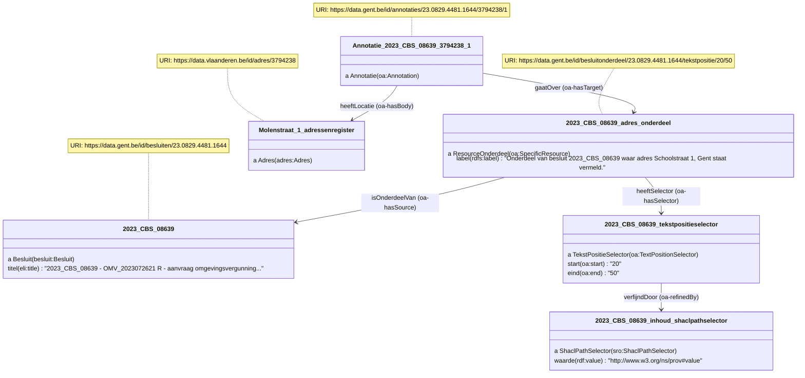


## Administrative information

**_Editors:_**
- first read [deze richtlijnen](https://github.com/Informatievlaanderen/OSLO-toolchain/blob/master/doc-user/README.md) .
- Use [TagsAndNotes.xlsm](https://github.com/Informatievlaanderen/OSLO-allerleiTooltjes/tree/master/EA-Excel/TagsAndNotes)
  to edit tags in Excel. The files `*.xlsm` are included in the repo as git-ignored.

### Tags
To refer to the available git tags to create a publication point from, see the "Releases" tab of this repo.


### Branches
The organisation and meaning of the git branches are documented in this table.


| Branch | Purpose | Active (y/n) |
| ------ | --------- | ---------------- |
| main  | Contains latest diagram | y |
| standaardenregister  | Contains artefacts for standaardenregister | y |
