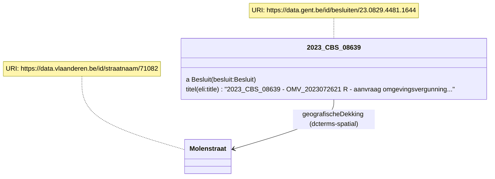
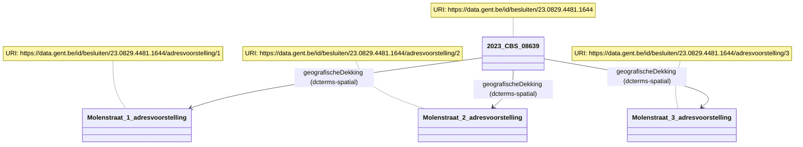
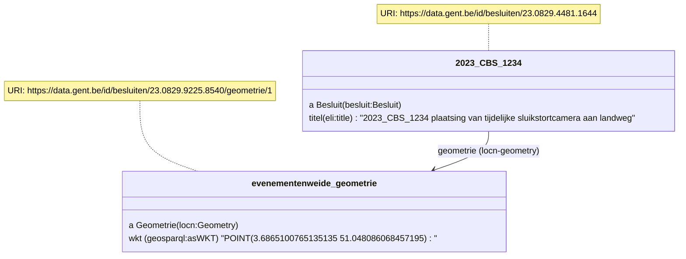
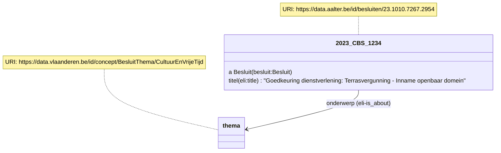
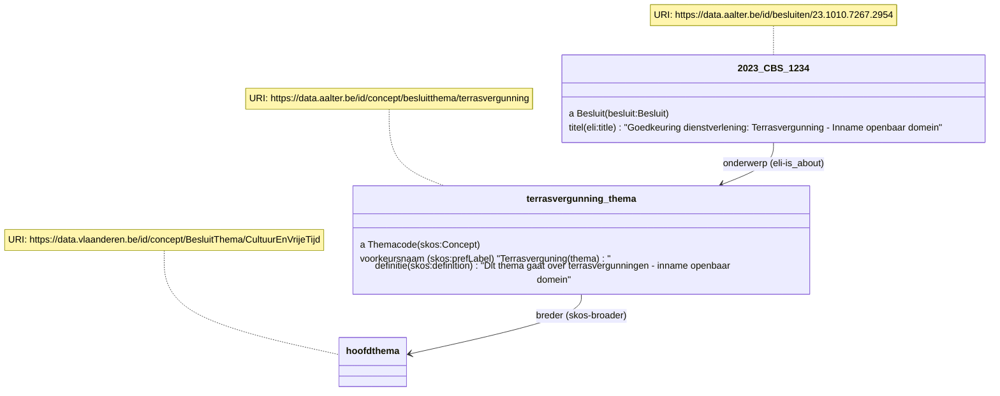
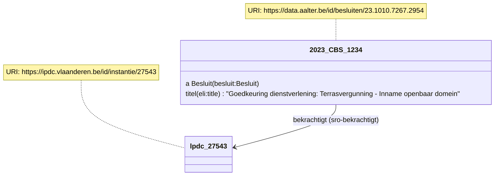
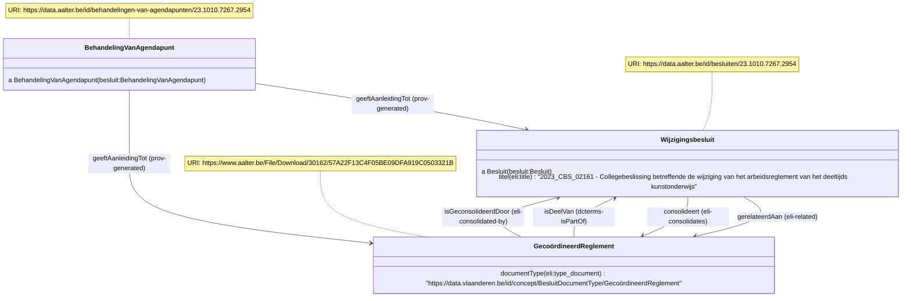

# OSLO Slimme Raadpleegomgeving

De opzet van dit traject is om inhoudelijke annotaties toe te voegen aan de besluiten. Er wordt hierbij gekeken naar het toevoegen van geo-informatie (straten, wijken, …), thema-informatie en het linken van reglementen zodat een gecoördineerde versie steeds centraal beschikbaar is.

# Voorbeelden

## Locatie-gebaseerde informatie

Het AP gebruikt de eigenschap [geografischeDekking](http://purl.org/dc/terms/spatial) om locaties te linken aan een besluit(onderdeel). Het bereik hiervan is het generieke [Locatie](http://www.w3.org/ns/prov#Location) dat geïmplementeerd kan worden met coördinaten, een plaats, een adres...
Hieronder geven we een aantal voorbeelden van zo'n locaties.

### Een straatnaam

Indien mogelijk proberen we te linken naar een basisregister.

Bijvoorbeeld, een straatnaam kan als volgt gelinkt worden:
```
<div prefix="besluit: http://data.vlaanderen.be/ns/besluit# eli: http://data.europa.eu/eli/ontology# dcterms: http://purl.org/dc/terms/" property="prov:generated" typeof="besluit:Besluit" resource="https://data.gent.be/id/besluiten/23.0829.4481.1644">
  <span property="eli:title" datatype="xsd:string">2023_CBS_08639 - OMV_2023072621 R - aanvraag omgevingsvergunning voor het verbouwen en uitbreiden van een eengezinswoning  - zonder openbaar onderzoek  - <span property="dcterms:spatial" resource="https://data.vlaanderen.be/id/straatnaam/71082">Molenstraat</span>, 9032 Gent - Vergunning</span>
</div>
```



Om de link op te halen werd het SPARQL endpoint van Digitaal Vlaanderen gebruikt met [deze query](https://query.linkeddatafragments.org/#datasources=https%3A%2F%2Fdata.vlaanderen.be%2Fsparql&query=PREFIX%20adres%3A%20%3Chttps%3A%2F%2Fdata.vlaanderen.be%2Fns%2Fadres%23%3E%0APREFIX%20prov%3A%20%3Chttp%3A%2F%2Fwww.w3.org%2Fns%2Fprov%23%3E%0A%0ASELECT%20distinct%20*%0AWHERE%20%7B%0A%20%20%20%20%3Fstraatnaam%20a%20adres%3AStraatnaam%20%3B%0A%20%20%20%20%20%20%20rdfs%3Alabel%20%3Fstraatnaamlabel%20%3B%0A%20%20%20%20%20%20prov%3AwasAttributedTo%20%3Fgemeente%20.%0A%20%20%20%20%0A%20%20%20%20%20%20%20%3Fgemeentenaam%20adres%3AisAfgeleidVan%20%3Fgemeente%20%3B%0A%20%20%20%20%20%20%20%20%20%20%20%20%20%20%20rdfs%3Alabel%20%3Fgemeentelabel%20.%0A%20%20%20%20%20%20%0A%20%20%20%20%20%20FILTER%20(str(%3Fstraatnaamlabel)%20%3D%20%22Molenstraat%22)%0A%20%20%20%20%20%20FILTER%20(str(%3Fgemeentelabel)%20%3D%20%22Gent%22)%0A%7D).
Andere mogelijkheid is het gebruik van de [basisregisters Vlaanderen API](https://docs.basisregisters.vlaanderen.be/docs/api-documentation.html).

### Een adres

Bij adressen wordt gebruik gemaakt van [Adresvoorstellingen](https://data.vlaanderen.be/doc/applicatieprofiel/adresregister/#Adresvoorstelling) die op hun beurt verwijzen naar een adres in het basisregister.

```
<div prefix="besluit: http://data.vlaanderen.be/ns/besluit# eli: http://data.europa.eu/eli/ontology# dcterms: http://purl.org/dc/terms/ adres: https://data.vlaanderen.be/ns/adres# locn:http://www.w3.org/ns/locn#"> 
<div property="prov:generated" typeof="besluit:Besluit" resource="https://data.gent.be/id/besluiten/23.0829.4481.1644">
  <span property="eli:title" datatype="xsd:string">2023_CBS_08639 - OMV_2023072621 R - aanvraag omgevingsvergunning voor het verbouwen en uitbreiden van een eengezinswoning  - zonder openbaar onderzoek  - <span property="dcterms:spatial" resource="https://data.gent.be/id/besluiten/23.0829.4481.1644/adresvoorstelling/1">Molenstraat 1</span>, 9032 Gent - Vergunning</span>
</div>
<div typeof="locn:Address" resource="https://data.gent.be/id/besluiten/23.0829.4481.1644/adresvoorstelling/1">
<span property="adres:Adresvoorstelling.huisnummer" content="1"></span>
<span property="adres:gemeentenaam" content="Gent" language="nl"></span>
<span property="locn:postcode" content="9000"></span>
<span property="locn:thoroughfare" content="Molenstraat"></span>
<span property="adres:verwijstNaar" content="https://data.vlaanderen.be/id/adres/3794238"></span>
</div>
</div>
```


Het ophalen van een adres URI op basis van gemeentenaam, straatnaam en huisnummer werd met deze [query](https://query.linkeddatafragments.org/#datasources=https%3A%2F%2Fdata.vlaanderen.be%2Fsparql&query=PREFIX%20adres%3A%20%3Chttps%3A%2F%2Fdata.vlaanderen.be%2Fns%2Fadres%23%3E%0APREFIX%20prov%3A%20%3Chttp%3A%2F%2Fwww.w3.org%2Fns%2Fprov%23%3E%0A%0ASELECT%20distinct%20*%0AWHERE%20%7B%0A%20%20%09%3Fadres%20adres%3AheeftStraatnaam%20%3Fstraatnaam%20%3B%0A%20%20%20%20%20%20%20%20%20%20adres%3Ahuisnummer%20%3Fhuisnummer%20.%0A%20%20%0A%20%20%20%20%3Fstraatnaam%20a%20adres%3AStraatnaam%20%3B%0A%20%20%20%20%20%20%20rdfs%3Alabel%20%3Fstraatnaamlabel%20%3B%0A%20%20%20%20%20%20prov%3AwasAttributedTo%20%3Fgemeente%20.%0A%20%20%20%20%0A%20%20%20%20%20%20%20%3Fgemeentenaam%20adres%3AisAfgeleidVan%20%3Fgemeente%20%3B%0A%20%20%20%20%20%20%20%20%20%20%20%20%20%20%20rdfs%3Alabel%20%3Fgemeentelabel%20.%0A%20%20%20%20%20%20%0A%20%20%20%20%20%20FILTER%20(str(%3Fstraatnaamlabel)%20%3D%20%22Molenstraat%22)%0A%20%20%20%20%20%20FILTER%20(%3Fgemeentelabel%20%3D%20%22Gent%22)%0A%20%20%20%20%20%20BIND%20(str(%3Fhuisnummer)%20as%20%3Fhuisnummerstring)%0A%20%20%20%20%20%20FILTER%20(%3Fhuisnummerstring%20%3D%20%221%22)%0A%7D) gedaan.

### Combinatie van straat en huisnummers

Wanneer er meerdere huisnummers geannoteerd worden, raden we aan om elk adres apart te linken.
De adresvoorstellingen dienen apart beschreven te worden zoals hierboven getoond.

```
<div prefix="besluit: http://data.vlaanderen.be/ns/besluit# eli: http://data.europa.eu/eli/ontology# dcterms: http://purl.org/dc/terms/ adres: https://data.vlaanderen.be/ns/adres# locn:http://www.w3.org/ns/locn#"> 
<div property="prov:generated" typeof="besluit:Besluit" resource="https://data.gent.be/id/besluiten/23.0829.4481.1644">
  <span property="eli:title" datatype="xsd:string">2023_CBS_08639 - OMV_2023072621 R - aanvraag omgevingsvergunning voor het verbouwen en uitbreiden van een eengezinswoning  - zonder openbaar onderzoek  -
<span property="dcterms:spatial" resource="https://data.gent.be/id/besluiten/23.0829.4481.1644/adresvoorstelling/1">Molenstraat 1</span>
<span property="dcterms:spatial" resource="https://data.gent.be/id/besluiten/23.0829.4481.1644/adresvoorstelling/2"></span>
<span property="dcterms:spatial" resource="https://data.gent.be/id/besluiten/23.0829.4481.1644/adresvoorstelling/3"></span>
tem
<span property="dcterms:spatial" resource="https://data.gent.be/id/besluiten/23.0829.4481.1644/adresvoorstelling/4">10</span>
    , 9032 Gent - Vergunning</span>
</div>
</div>
```



### Een plaats met naam en geometrie

Om een bepaalde plaats aan te duiden, zoals een wijk of evenementenweide, met een naam en geometrie kunnen we [Plaats](https://data.vlaanderen.be/doc/applicatieprofiel/generiek-basis/#Plaats) van OSLO generiek gebruiken.

```
<div prefix="besluit: http://data.vlaanderen.be/ns/besluit# eli: http://data.europa.eu/eli/ontology# dcterms: http://purl.org/dc/terms/ adres: https://data.vlaanderen.be/ns/adres# locn: http://www.w3.org/ns/locn# rdfs: http://www.w3.org/2000/01/rdf-schema# geosparql: http://www.opengis.net/ont/geosparql#"> 
  <div property="prov:generated" typeof="besluit:Besluit" resource="https://data.gent.be/id/besluiten/23.0829.9225.8540">
    <span property="eli:title" datatype="xsd:string">2023_CBS_08501 - 15748/M/1 - Geluidsuitzending - op donderdag 21 september 2023 (Gentsterpop) op de
    <div property="dcterms:spatial" typeof="locn:Location" resource="https://data.gent.be/id/besluiten/23.0829.9225.8540/plaats/1">
      <span property="rdfs:label">evenementenweide van de Blaarmeersen aan de Duiklaan te Gent</span>.
      <div property="locn:geometry" typeof="locn:Geometry" resource="https://data.gent.be/id/besluiten/23.0829.9225.8540/plaats/1/geometrie/1">
<span property="geosparql:asWKT" content="POINT(3.6865100765135135 51.048086068457195)"" datatype="geosparql:wktLiteral"></span>
      </div>
    </div>
  </div>
</div>
```


### Enkel coördinaten

Om enkel coördinaten te linken met het besluit, dient nog altijd met Geometrie gewerkt te worden.
Bijvoorbeeld: plaatsing van tijdelijke sluikstortcamera aan landweg.

```
<div prefix="besluit: http://data.vlaanderen.be/ns/besluit# eli: http://data.europa.eu/eli/ontology# dcterms: http://purl.org/dc/terms/ adres: https://data.vlaanderen.be/ns/adres# locn: http://www.w3.org/ns/locn# rdfs: http://www.w3.org/2000/01/rdf-schema# geosparql: http://www.opengis.net/ont/geosparql#"> 
  <div property="prov:generated" typeof="besluit:Besluit" resource="https://data.gent.be/id/besluiten/23.0829.9225.8540">
    <span property="eli:title" datatype="xsd:string">2023_CBS_1234 plaatsing van tijdelijke sluikstortcamera aan landweg></span>
      <div property="locn:geometry" typeof="locn:Geometry" resource="https://data.gent.be/id/besluiten/23.0829.9225.8540/geometrie/1">
<span property="geosparql:asWKT" content="POINT(3.6865100765135135 51.048086068457195)"" datatype="geosparql:wktLiteral"></span>
      </div>
    </div>
  </div>
</div>
```



## Thema's

### Linken aan een thema

Hoofdthema's worden aangeboden via [deze codelijst](https://data.vlaanderen.be/doc/conceptscheme/BesluitThema).
Bijvoorbeeld `https://data.vlaanderen.be/id/concept/BesluitThema/CultuurEnVrijeTijd`
De bedoeling is dat deze hoofdthema's gekoppeld worden met diverse rapporteringen zoals BBC en stadsmonitor.

De relatie `eli:is_about` wordt gebruikt om de link tussen het besluit en het thema te maken:
```
<div prefix="sro: https://data.vlaanderen.be/ns/slimmeraadpleegomgeving# besluit: http://data.vlaanderen.be/ns/besluit# eli: http://data.europa.eu/eli/ontology# dcterms: http://purl.org/dc/terms/ adres: https://data.vlaanderen.be/ns/adres# locn: http://www.w3.org/ns/locn# rdfs: http://www.w3.org/2000/01/rdf-schema# geosparql: http://www.opengis.net/ont/geosparql#"> 
  <div property="prov:generated" typeof="besluit:Besluit" resource="https://data.aalter.be/id/besluiten/23.1010.7267.2954">
    <span property="eli:title" datatype="xsd:string">Goedkeuring dienstverlening: Terrasvergunning - Inname openbaar domein</span>
    <span property="eli:is_about" resource="https://data.vlaanderen.be/id/concept/BesluitThema/CultuurEnVrijeTijd"></span>
  </div>
</div>
```



### Subthema's definiëren

Lokaal kunnen er specifiekere thema's gebruikt worden. Hierbij dient een relatie `skos:broader` of `skos:related` voorzien te worden naar een hoofdthema uit de codelijst van hierboven.

```
<div prefix="sro: https://data.vlaanderen.be/ns/slimmeraadpleegomgeving# besluit: http://data.vlaanderen.be/ns/besluit# eli: http://data.europa.eu/eli/ontology# dcterms: http://purl.org/dc/terms/ adres: https://data.vlaanderen.be/ns/adres# locn: http://www.w3.org/ns/locn# rdfs: http://www.w3.org/2000/01/rdf-schema# geosparql: http://www.opengis.net/ont/geosparql#" skos: http://www.w3.org/2004/02/skos/core#> 
  <div property="prov:generated" typeof="besluit:Besluit" resource="https://data.aalter.be/id/besluiten/23.1010.7267.2954">
    <span property="eli:title" datatype="xsd:string">Goedkeuring dienstverlening: Terrasvergunning - Inname openbaar domein</span>
    <div property="eli:is_about" resource="https://data.aalter.be/id/concept/besluitthema/terrasvergunning" typeof="skos:Concept">
      <span property="skos:prefLabel" content="Terrasverguning (thema)"></span>
      <span property="skos:definition" content="Dit thema gaat over terrasvergunningen - inname openbaar domein"></span>
      <span property="skos:broader skos:related" resource="https://data.vlaanderen.be/id/concept/BesluitThema/CultuurEnVrijeTijd"></span>
    </div>
  </div>
</div>
```


## LPDC-codes

Om te verwijzen naar een LPDC/IPDC-code wordt er verwezen naar een URI, zoals `https://ipdc.vlaanderen.be/id/instantie/27543`.

Het voorbeeld hieronder legt de "bekrachtigt"-relatie tussen een besluit en het LPDC product (instantie van een conceptual public service).
```
<div prefix="sro: https://data.vlaanderen.be/ns/slimmeraadpleegomgeving# besluit: http://data.vlaanderen.be/ns/besluit# eli: http://data.europa.eu/eli/ontology# dcterms: http://purl.org/dc/terms/ adres: https://data.vlaanderen.be/ns/adres# locn: http://www.w3.org/ns/locn# rdfs: http://www.w3.org/2000/01/rdf-schema# geosparql: http://www.opengis.net/ont/geosparql#"> 
  <div property="prov:generated" typeof="besluit:Besluit" resource="https://data.aalter.be/id/besluiten/23.1010.7267.2954">
    <span property="eli:title" datatype="xsd:string">Goedkeuring dienstverlening: Terrasvergunning - Inname openbaar domein</span>
    <span property="sro:bekrachtigt" resource="https://ipdc.vlaanderen.be/id/instantie/27543"></span>
  </div>
</div>
```



## Gecoördineerde versies van reglementen als bijlage van een besluit

We volgen hiervoor de documentatie op de [vendor pagina's](https://lblod.github.io/pages-vendors/#/docs/decision-attachments
), mits uitbreiding:

* de behandeling van agendapunt wordt gelinkt met `prov:generated` met 2 besluiten: het wijzigingsbesluit + gecoördineerde reglement
* Het gecoördineerde reglement krijgt een type `gecoördineerd reglement` (work in progress om dit toe te voegen)
* Uitbreiding: naast het linken van de 2 besluiten met `eli:related` en `dcterms:isPartOf`, wordt ook `eli:consolidates` en `eli:consolidated_by` gebruikt

```
<div prefix="sro: https://data.vlaanderen.be/ns/slimmeraadpleegomgeving# besluit: http://data.vlaanderen.be/ns/besluit# eli: http://data.europa.eu/eli/ontology# dcterms: http://purl.org/dc/terms/ adres: https://data.vlaanderen.be/ns/adres# locn: http://www.w3.org/ns/locn# rdfs: http://www.w3.org/2000/01/rdf-schema# geosparql: http://www.opengis.net/ont/geosparql#"> 
  <div typeof="besluit:BehandelingVanAgendapunt" resource="https://data.aalter.be/id/behandelingen-van-agendapunten/23.1010.7267.2954">
  <div property="prov:generated" typeof="besluit:Besluit" resource="https://data.aalter.be/id/besluiten/23.1010.7267.2954">
    <span property="eli:title" datatype="xsd:string">2023_CBS_02161 - Collegebeslissing betreffende de wijziging van het arbeidsreglement van het deeltijds kunstonderwijs</span>
    <span property="eli:related eli:consolidates" rev="dcterms:isPartOf eli:consolidated_by" resource="https://www.aalter.be/File/Download/30162/57A22F13C4F05BE09DFA919C0503321B" typeof="besluit:Besluit"></span>
  </div>
  <div property="prov:generated" typeof="besluit:Besluit" resource="https://www.aalter.be/File/Download/30162/57A22F13C4F05BE09DFA919C0503321B">
      <span property="eli:type_document" content="https://data.vlaanderen.be/id/concept/BesluitDocumentType/TODO"></span>
      <span property="eli:title" datatype="xsd:string" content="Het gewijzigde arbeidsreglement voor de Academie voor muziek, woord en dans"></span>
  </div>
    </div>
</div>
</div>
```



## Proof of concept: besluiten in mijn directe leefomgeving, de school van mijn kinderen, de buurt waar ik dikwijls vertoef, de leefomgeving van een familielid, de omgeving van een pand dat in mijn bezit is, een traject waar ik dikwijls langs rijd, …)

Idee: met GeoSPARQL kunnen besluiten in een bepaalde polygoon bevraagd worden 

## Zoeken adhv woorden in besluiten

Dit is een functionaliteit dat ingebouwd moet worden in raadpleegomgevingen en staat los van het model.
Bijvoorbeeld bij: [Green Valley](https://raadpleeg-aalter.onlinesmartcities.be/zoeken?query=pakjesautomaat&organId=&meetingDateStart=&meetingDateEnd=&typeId=&title=&page=0&pageSize=10) en [Lokaal Beslist](https://lokaalbeslist.lblod.info/agendapunten?gemeentes=Aalter&trefwoord=pakjesautomaat).

## Drones boven mijn gemeente. Is dit toegestaan?

Om de inhoud van besluiten gedetailleerd te ontsluiten (welke actoren, objecten, locaties) wordt er gekeken naar de FLINT ontology en OSLO-Steps. Dit is nog volop in onderzoek.

## Administrative information

**_Editors:_**
- first read [deze richtlijnen](https://github.com/Informatievlaanderen/OSLO-toolchain/blob/master/doc-user/README.md) .
- Use [TagsAndNotes.xlsm](https://github.com/Informatievlaanderen/OSLO-allerleiTooltjes/tree/master/EA-Excel/TagsAndNotes) 
  to edit tags in Excel. The files `*.xlsm` are included in the repo as git-ignored.

### Tags
To refer to the available git tags to create a publication point from, see the "Releases" tab of this repo.


### Branches
The organisation and meaning of the git branches are documented in this table.


| Branch | Purpose | Active (y/n) |
| ------ | --------- | ---------------- | 
| main  | Contains latest diagram | y |
| standaardenregister  | Contains artefacts for standaardenregister | y |

